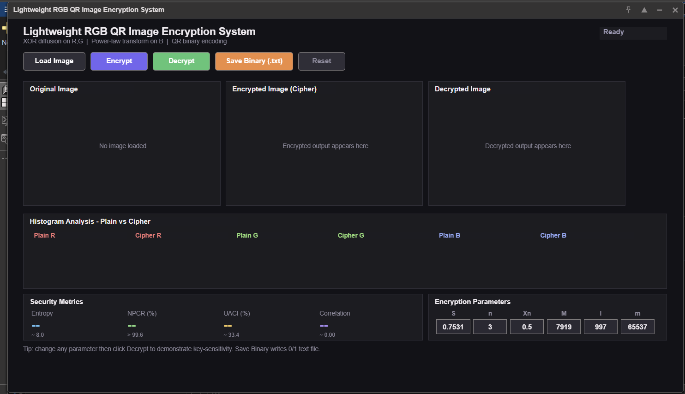
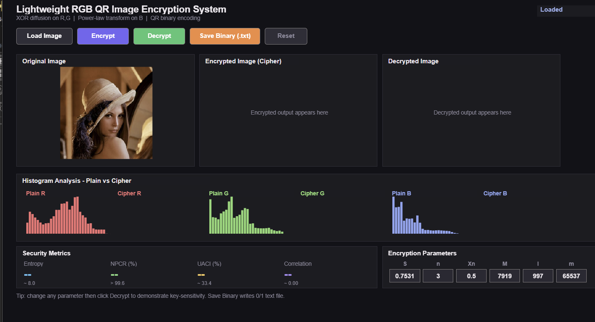
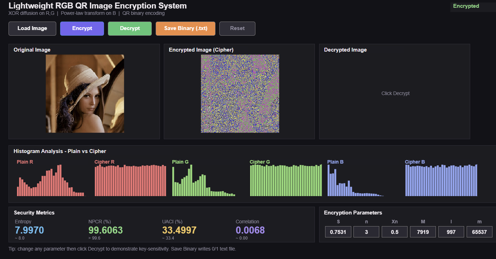
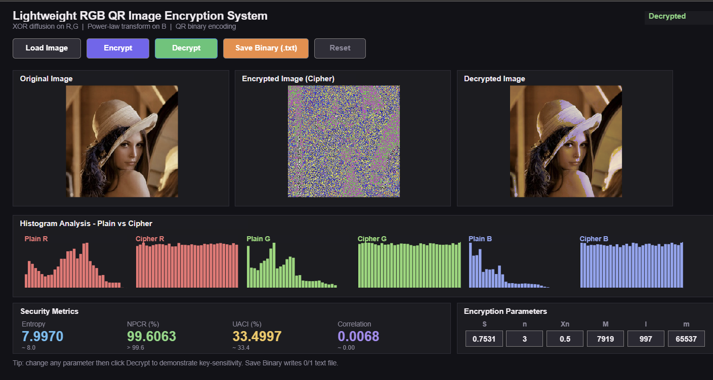

# Color-Image-Encryption

Color Image Encryption Using Lightweight Encrypting Techniques

## Description

This project performs color image encryption and decryption using lightweight cryptographic techniques in MATLAB.

## Features

- Image encryption
- Image decryption
- Dashboard visualization
- NIST graph analysis

## Technologies Used

- MATLAB
- Image Processing Toolbox

## Files

- main_code.m
- encryption.m
- decryption.m

## Input Images

- Barbara
- Baboon
- Mandrill
- Pepper

## Outputs

- Encrypted image
- Decrypted image
- Dashboard results

## How to Run

1. Open MATLAB
2. Open the project folder
3. Run `main_code.m`
4. Select input image
5. View encrypted and decrypted outputs

## Project Objective

The main objective of this project is to provide secure color image encryption using lightweight encryption techniques with low computational complexity and efficient performance.

## Applications

- Secure image transmission
- Medical image protection
- Military communication
- Cloud image security
- Multimedia data protection

  ## Results

### Dashboard

### Original Image

### Encrypted Image

### Decrypted Image

